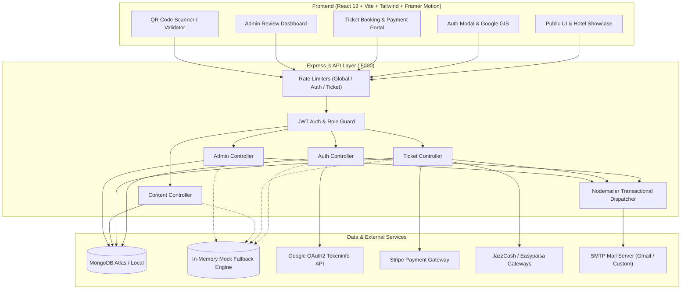
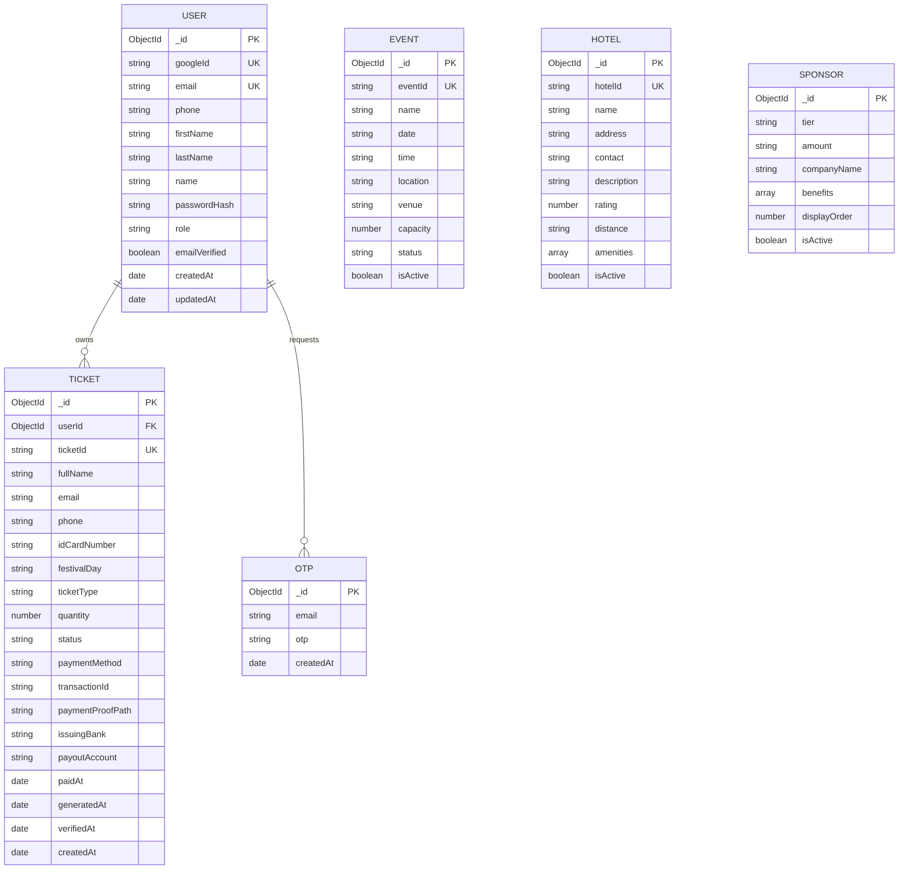
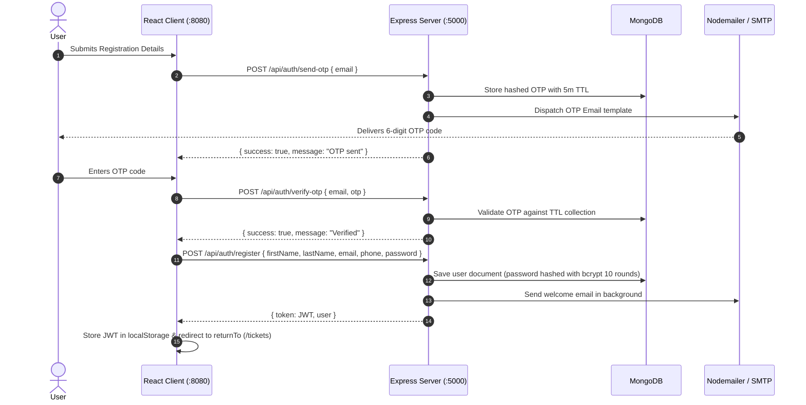
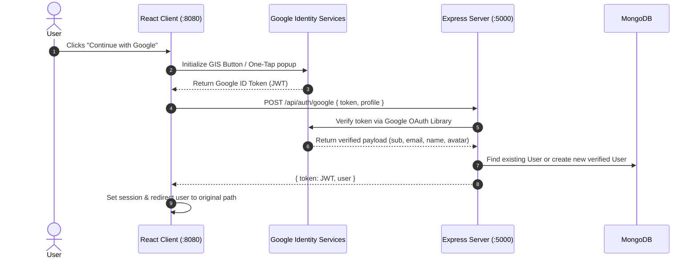
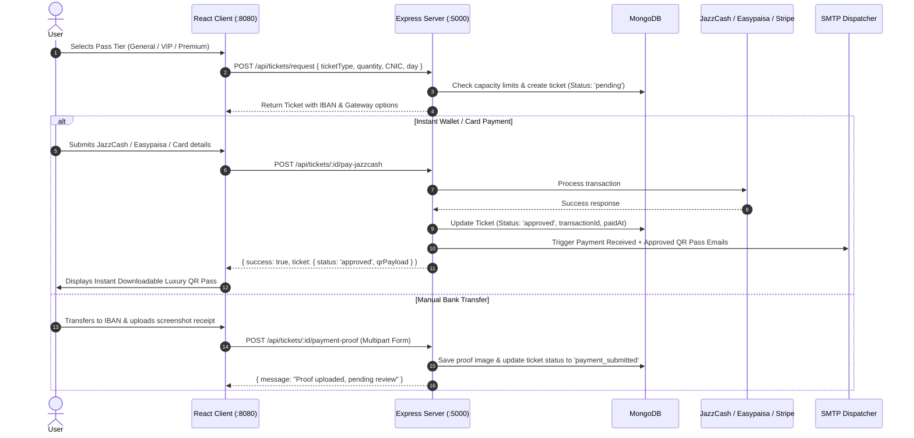
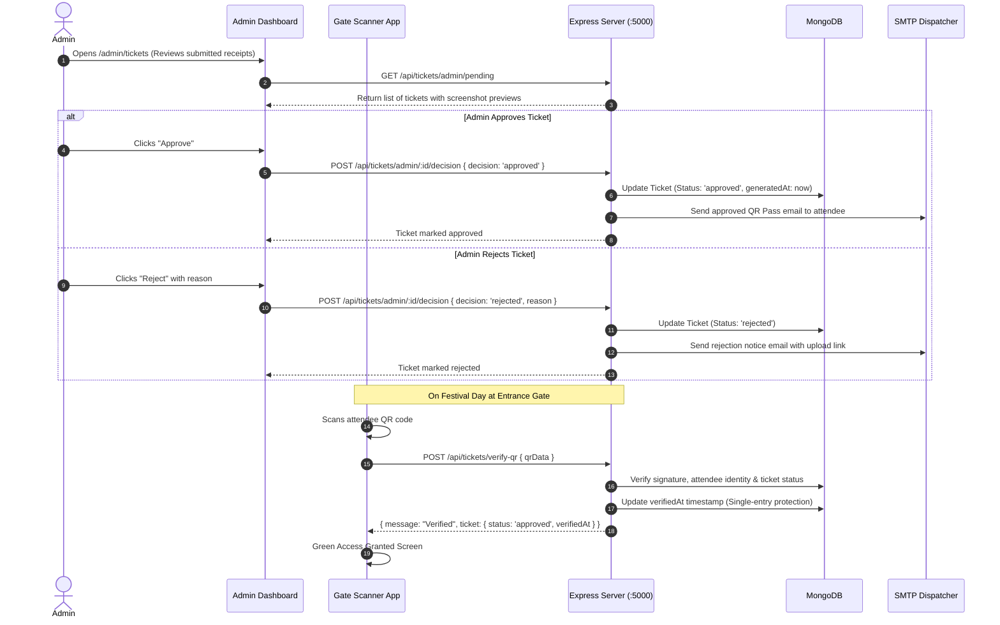

# OZILLA FEST 2026 — Software Requirements Specification (SRS) & System Architecture Document

---

## 1. Executive Summary & Product Scope

**OZILLA FEST 2026** is Pakistan's premier luxury music, cultural, and sponsorship festival platform. The platform serves thousands of attendees, VIP guests, brand sponsors, and event administrators. 

### Core Product Goals
1. **Public Discovery & Brand Experience**: High-performance showcase for festival lineup, schedule, sponsor tiers, and luxury partner hotels with zero-auth public access.
2. **Unified Authentication**: Multi-modal authentication supporting Email/Password, OTP verification, and official Google OAuth 2.0 GIS (Google Identity Services) with automatic return-path redirects.
3. **Omni-Channel Ticket Portal**: High-conversion pass booking for General, VIP, and Premium tiers with real-time capacity monitoring and automated pre-filling from customer profiles.
4. **Comprehensive Payment Processing**: Direct support for Pakistani payment rails (JazzCash, Easypaisa, IBAN bank transfer with screenshot proof) and International Credit/Debit cards via Stripe.
5. **Admin Verification & Fraud Prevention**: Admin dashboard for approving/rejecting manual payment receipts, dynamic ticket status management, and tamper-resistant cryptographic QR scanning.

---

## 2. User Roles & Permission Matrix

| Role | Permissions & Capabilities |
| :--- | :--- |
| **Anonymous Guest** | View public landing page, festival schedule, hotel accommodations, facilities, sponsor tiers, and ticket pricing. |
| **Authenticated Customer** | Book festival passes, initiate gateway payments, upload bank receipts, view personal QR passes, cancel pending tickets, update personal profile. |
| **Event Admin** | View administrative analytics, inspect all users & orders, approve or reject submitted payment proofs, review audit logs. |
| **Gate Scanner / Staff** | Scan attendee QR codes at festival entrance gates, perform real-time cryptographic and database validation to grant or deny ingress. |

---

## 3. High-Level System Architecture

---

## 4. Entity Relationship Diagram (ERD)

---

## 5. End-to-End Sequence Diagrams

### 5.1 User Authentication & Registration (Email + OTP)

---

### 5.2 Google OAuth 2.0 GIS Flow

---

### 5.3 Ticket Purchase & Multi-Gateway Processing

---

### 5.4 Admin Review & QR Pass Validation

---

## 6. API Specification & Status Codes

| Endpoint | Method | Auth | Description | Status Codes |
| :--- | :--- | :--- | :--- | :--- |
| `/api/health` | GET | Public | Server & DB health probe | `200` |
| `/api/auth/send-otp` | POST | Public | Generates & dispatches 6-digit email OTP | `200`, `400`, `409`, `429` |
| `/api/auth/verify-otp` | POST | Public | Validates email OTP token | `200`, `400` |
| `/api/auth/register` | POST | Public | Creates verified user account | `201`, `400`, `409` |
| `/api/auth/login` | POST | Public | Authenticates user with JWT return | `200`, `400`, `401`, `429` |
| `/api/auth/google` | POST | Public | Verifies Google ID token and logs user in | `200`, `400`, `401` |
| `/api/auth/me` | GET | Bearer | Returns current authenticated profile | `200`, `401` |
| `/api/auth/profile` | PUT | Bearer | Updates user name & phone number | `200`, `400`, `409` |
| `/api/content/events` | GET | Public | Returns upcoming festival events | `200` |
| `/api/content/hotels` | GET | Public | Returns curated 5-star partner hotels | `200` |
| `/api/content/sponsors` | GET | Public | Returns sponsorship packages & tiers | `200` |
| `/api/tickets/availability`| GET | Public | Live remaining capacity per pass tier | `200` |
| `/api/tickets/request` | POST | Bearer | Reserves pass and creates pending order | `201`, `400`, `409` |
| `/api/tickets/my-tickets` | GET | Bearer | Returns tickets owned by current user | `200`, `401` |
| `/api/tickets/:id/pay-card` | POST | Bearer | Instant card payment via Stripe | `200`, `400`, `404` |
| `/api/tickets/:id/pay-jazzcash` | POST | Bearer | Instant JazzCash wallet deduction | `200`, `400`, `404` |
| `/api/tickets/:id/pay-easypaisa` | POST | Bearer | Instant Easypaisa wallet deduction | `200`, `400`, `404` |
| `/api/tickets/:id/payment-proof` | POST | Bearer | Uploads transfer screenshot (max 5MB) | `200`, `400`, `404` |
| `/api/tickets/verify-qr` | POST | Public | Validates attendee QR cryptographic pass | `200`, `400`, `404` |
| `/api/tickets/admin/pending` | GET | Admin | Lists pending orders awaiting verification | `200`, `403` |
| `/api/tickets/admin/:id/decision` | POST | Admin | Approves or rejects payment submission | `200`, `400`, `403` |
